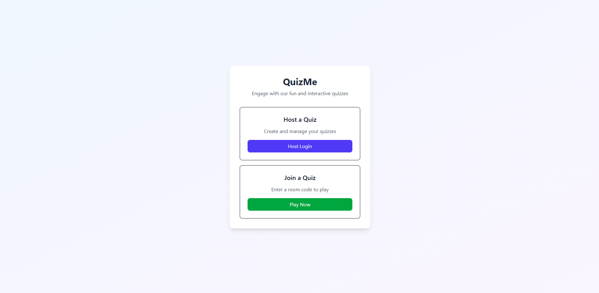
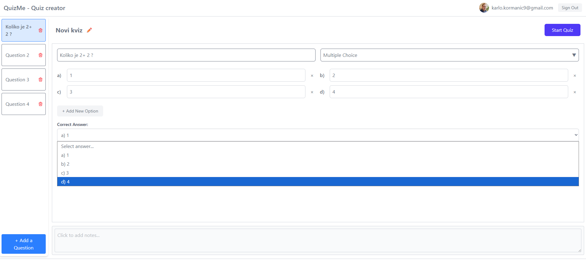
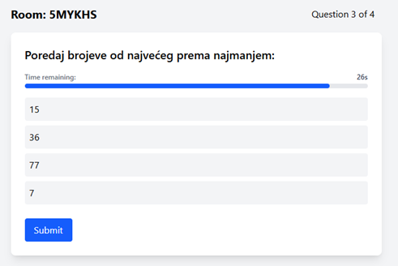
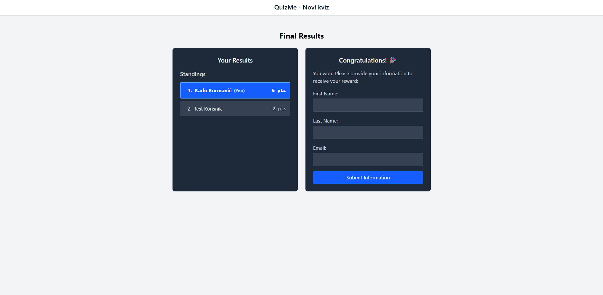

# QuizMe

QuizMe is a web-application for creating, running and participating in quizes.



Quiz hosts can login via google account and create a new quiz, edit their existing quiz and run them. Quiz players can join a quiz via unique quiz room code or by scanning the QR code. Both codes are provided by host when starting a new quiz.



Host can edit a quiz title, number of questions, question title, question type (multiple choice, checkbox or scale), potential answers as well as pick correct answer/s.



Players can interact with the quiz and submit their answers.



At the end of the quiz host and every player is shown a leaderboard and winning players are prompted to leave their information in order to send them their reward.

## Built With

- Next.js
- React
- Typescript
- Tailwind.css
- Supabase (Postgres database)

## Installation

Follow the path into the local folder of the downloaded project and run:

```bash
npm install
```

IMPORTANT: The project is currently connected to the Supabase database and hosted on Vercel. In order for your local version to work, you will have to change that connection.

